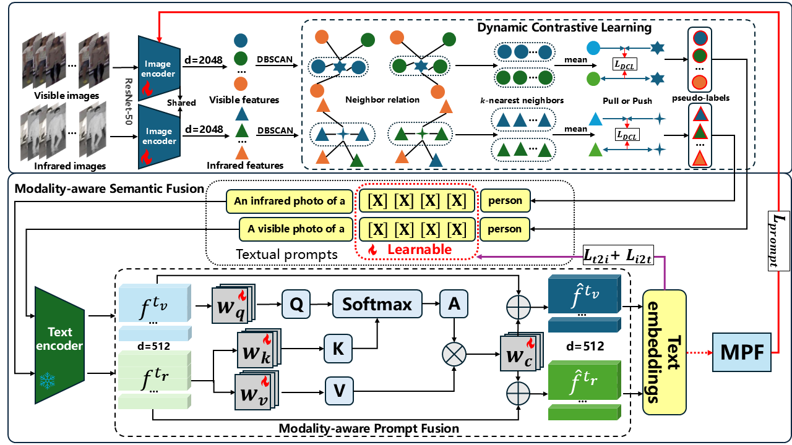

### Method



### Installation

```
conda create -n SAMCL python=3.9
conda activate SAMCL
conda install pytorch==1.12.1 torchvision==0.13.1 torchaudio==0.12.1 cudatoolkit=11.3 -c pytorch
conda install tqdm
conda install scikit-learn

pip install yacs
pip install timm
pip install scikit-image
pip install ftfy
pip install easydict
pip install regex
pip install faiss-gpu
```

 
  

### Training


run `python data/process.py` to pepare the dataset, the training data will be stored in ".npy" format.
```
For SYSU-MM01:
CUDA_VISIBLE_DEVICES=0 python train_prepare_sysu.py
For RegDB:
CUDA_VISIBLE_DEVICES=0 python train_prepare_regdb.py
# training (For SYSU-MM01)
CUDA_VISIBLE_DEVICES=0 python train_clip_sysu.py 

# training (For RegDB)
CUDA_VISIBLE_DEVICES=0 python train_clip_regdb.py 
```

### Evaluation

```
CUDA_VISIBLE_DEVICES=0 python test.py --dataset 'sysu' --resume_path 'checkpoints/model_best.pth'
```
```
CUDA_VISIBLE_DEVICES=0 python test.py --dataset 'regdb' --resume_path 'checkpoints/model_best.pth'
```